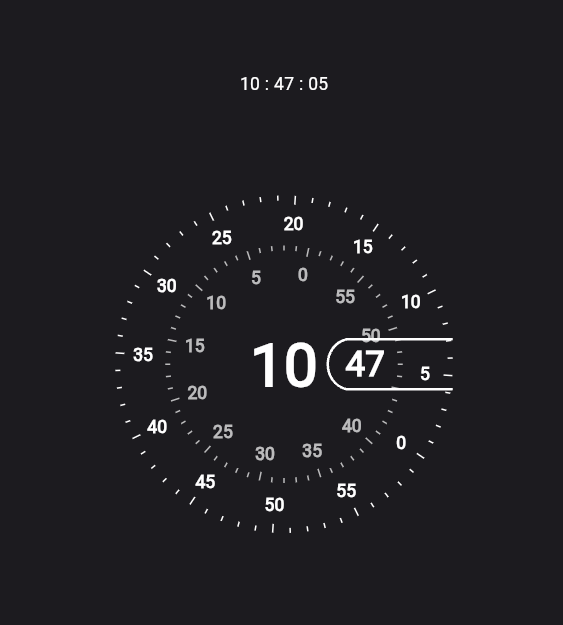

# Concentric

Concentric is a Google Pixel-inspired watch face made using Flutter.

## About

Concentric is a stylish and minimalistic watch face designed for Flutter developers. It draws inspiration from the clean and modern design language of Google Pixel devices, offering a sleek and elegant look for your smartwatch.

## Installation

To use the Concentric watch face in your Flutter project, follow these steps:

1. Clone or download the Concentric project repository.
2. Open the project in your preferred Flutter development environment.
3. Build and run the project on your target device or emulator.

## Contributing

Contributions are welcome! If you have any ideas, suggestions, or bug reports, please feel free to open an issue or submit a pull request on the Concentric project repository.

## License

Concentric is released under the [MIT License](LICENSE).

